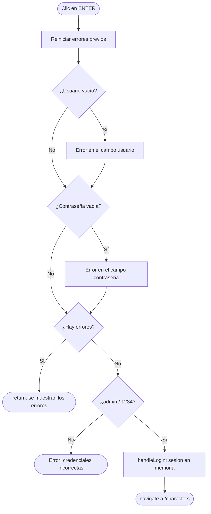
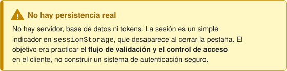
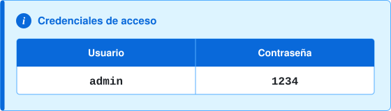
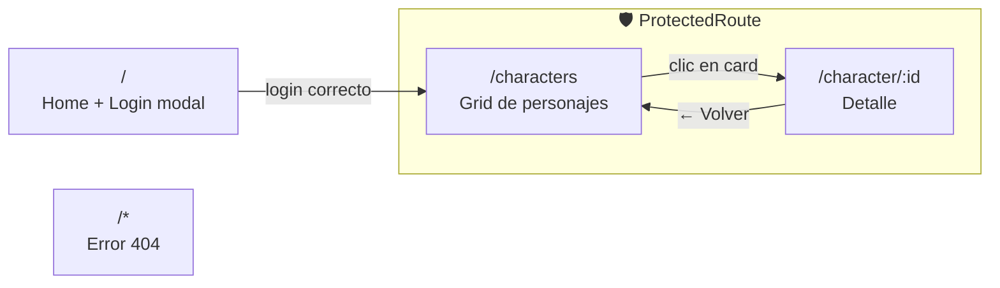

<div align="center">


# Dragon Ball · Character Explorer

**Una SPA en React para explorar los personajes de Dragon Ball, escrita línea a línea, a mano.**

<br />


</div>

---

## ✋ Hecho a mano, a propósito

Hoy en día una IA puede generar una aplicación como esta en pocos minutos. **Este proyecto no se hizo así.**

Lo desarrollé durante mi **último año del Grado Superior en Desarrollo de Aplicaciones Web (DAW)**, sin Copilot, sin ChatGPT y sin autocompletado inteligente. Solo tenía la documentación oficial de React, React Router y Tailwind, y tenía que ir resolviendo los problemas uno a uno.

Renuncié a la velocidad para quedarme con algo que valoro más: **entender cada línea que escribo**. Cada `useState`, cada redirección y cada clase de Tailwind está ahí porque tuve que pensarla, equivocarme y corregirla.

> *«Primero que funcione. Luego que esté bien hecho. Y solo al final, que sea bonito.»*

---

## 🎯 Conocimientos que refleja

<table>
<tr>
<td width="50%" valign="top">

### 🔐 Lógica de validación de un login
Un login en modal que se valida en local, **sin backend ni base de datos**:
- Validación por campo (usuario y contraseña vacíos)
- Validación de credenciales con un mensaje de error genérico
- Los errores se reinician en cada envío, para no mostrar estados antiguos
- *Early return* para no seguir validando si ya hay errores

</td>
<td width="50%" valign="top">

### 🧩 Componentización
La interfaz está dividida en piezas pequeñas y reutilizables:
- `Button`, `Input`, `CloseButton` y `Hero` como componentes de UI
- `CharactersCard` se renderiza con `map` a partir de los datos
- Las páginas componen esas piezas sin repetir marcado
- Comunicación entre componentes mediante **props y callbacks**

</td>
</tr>
<tr>
<td width="50%" valign="top">

### 🛡️ Rutas protegidas
- Componente `ProtectedRoute` que envuelve las vistas privadas
- Sin sesión, redirige con `<Navigate replace />`
- Estado de sesión **elevado** a `App` y compartido por props
- Ruta *catch-all* (`*`) para las URLs que no existen

</td>
<td width="50%" valign="top">

### 🌐 Consumo de una API REST
- `fetch` asíncrono dentro de `useEffect`
- Estados de **loading**, **error** y **datos**
- Bloque `try / catch / finally` para que la app no se rompa
- Ruta dinámica `/character/:id` leída con `useParams`

</td>
</tr>
</table>

---

## 🔐 El login, paso a paso

El login no usa ninguna librería de formularios ni de autenticación. Todo es estado de React y condicionales:



```jsx
let hasError = false;

if (!userName) { setErrorUserName("• Enter a username"); hasError = true; }
if (!userPass) { setErrorUserPass("• Enter a password"); hasError = true; }

if (hasError) return;

if (userName !== 'admin' || userPass !== '1234') {
    setErrorValidation("• User or password doesn't match");
    return;
}

handleLogin();
navigate('/characters');
```





---

## 🗺️ Rutas de la aplicación



| Ruta | Vista | Acceso |
| :--- | :--- | :---: |
| `/` | Landing con el botón *Get started*, que abre el modal de login | 🌍 Pública |
| `/characters` | Grid de personajes consumido desde la API | 🔒 Protegida |
| `/character/:id` | Ficha ampliada con descripción expandible (*Leer más / Leer menos*) | 🔒 Protegida |
| `*` | Página de error | 🌍 Pública |

---

## 🏗️ Arquitectura de componentes

```text
src/
├── App.jsx                     # Router + estado de sesión (isLogged, login, logout)
├── main.jsx                    # Punto de entrada
├── index.css                   # Tema de Tailwind: paleta y tipografía
└── components/
    ├── pages/                  # Vistas que componen la UI
    │   ├── Home.jsx            # Landing + apertura del modal
    │   ├── Login.jsx           # Formulario y lógica de validación
    │   ├── CharactersDashboard.jsx
    │   ├── CharacterDetails.jsx
    │   └── Error404.jsx
    └── ui/                     # Piezas reutilizables
        ├── Button.jsx
        ├── Input.jsx           # Label + error + input con estilo condicional
        ├── CloseButton.jsx
        ├── Hero.jsx            # Cabecera con el logo
        ├── CharactersCard.jsx
        └── ProtectedRoute.jsx  # Guardián de rutas privadas
```

**Cómo fluyen los datos:** `App` es el único dueño del estado de sesión. Pasa `handleLogin` a `Home` y de ahí a `Login`, y pasa `isLogged` a cada `ProtectedRoute`. Un único punto de verdad, sin contextos ni librerías de estado global.

---

## 🎨 Diseño

La paleta se definió como **tokens del tema de Tailwind v4** (`@theme`), así se usa con clases semánticas como `bg-DragoOrange` o `text-DragoAccentRed`:

| Token | Color | Uso |
| :--- | :---: | :--- |
| `DragoAccentRed` |  | Hover, errores, acentos |
| `DragoOrange` |  | Botones principales, landing |
| `DragoGray` |  | Texto, bordes, fondos de card |
| `DragoWhite` |  | Fondo general |

**Tipografía:** [Anton](https://fonts.google.com/specimen/Anton), importada desde Google Fonts y expuesta como `font-anton`.

---

## 🚀 Puesta en marcha

```bash
# 1. Clonar el repositorio
git clone <url-del-repositorio>
cd dragonBall

# 2. Instalar dependencias
npm install

# 3. Arrancar en desarrollo
npm run dev
```

| Script | Descripción |
| :--- | :--- |
| `npm run dev` | Servidor de desarrollo con Vite |
| `npm run build` | Build de producción |
| `npm run preview` | Previsualiza el build |
| `npm run lint` | Revisión con ESLint |

Los datos vienen de la API pública **[dragonball-api.com](https://dragonball-api.com)**.

---

## 📄 Contexto académico

Proyecto realizado para el módulo **Diseño de Interfaces Web** (2º DAW). El enunciado original, con los hitos y las restricciones de la prueba, está en **[ENUNCIADO.md](ENUNCIADO.md)** aunque yo decidí extenderlo un poco más.

<div align="center">
<br />


<p align="center">
  <code>All right reserved 2026 • © Juan Mira  </code>
</p>

</div>
